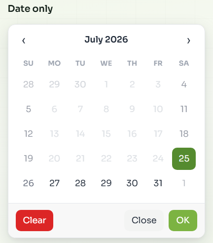
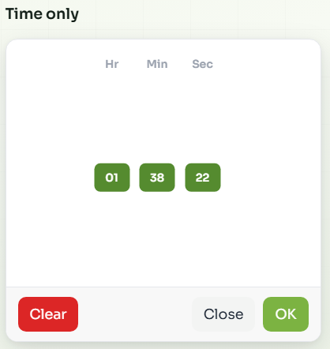
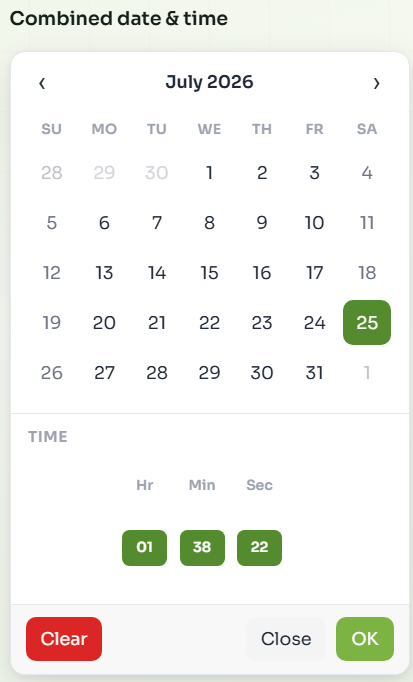
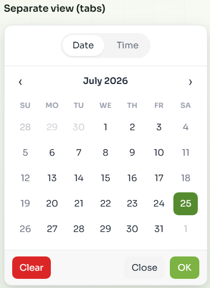
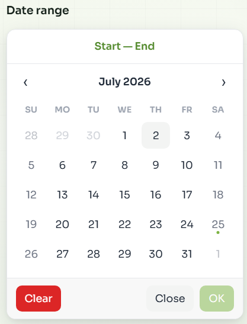
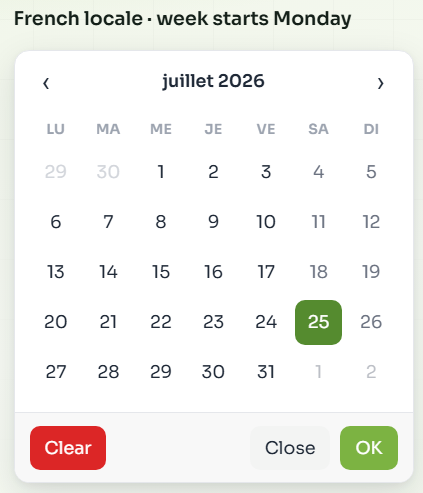
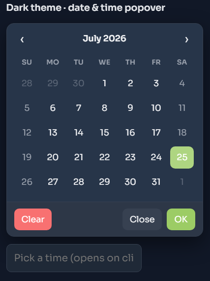
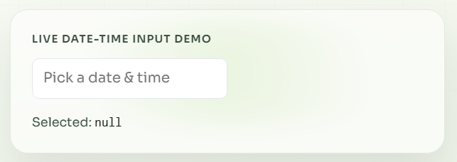

[](https://www.npmjs.com/package/universal-datetime-picker)
[](https://www.npmjs.com/package/universal-datetime-picker)
[](https://www.npmjs.com/package/universal-datetime-picker)
[](https://github.com/Bhardwaj-Raghav/universal-datetime-picker/actions/workflows/ci.yml)
[](https://github.com/Bhardwaj-Raghav/universal-datetime-picker/blob/main/LICENSE)

# universal-datetime-picker

**React date picker**, **date time picker**, **datetime picker**, and **date range calendar**. One accessible TypeScript package for React, Vue, Svelte, Angular, vanilla JS, and CDN. The [docs site](https://universal-datetime-picker.vercel.app) covers install guides, an examples playground, and per-framework pages.

Native React components share a headless core with a vanilla DOM renderer and Web Components (`<datetime-picker>`, `<datetime-picker-input>`, `<datetime-picker-range>`).

- **Docs:** [Getting started](https://universal-datetime-picker.vercel.app/docs/getting-started/) · [full docs](https://universal-datetime-picker.vercel.app/docs/)
- **Examples:** [Playground](https://universal-datetime-picker.vercel.app/examples/)
- **Frameworks:** [`/react/`](https://universal-datetime-picker.vercel.app/react/), [`/vue/`](https://universal-datetime-picker.vercel.app/vue/), [`/svelte/`](https://universal-datetime-picker.vercel.app/svelte/), [`/angular/`](https://universal-datetime-picker.vercel.app/angular/), [`/vanilla/`](https://universal-datetime-picker.vercel.app/vanilla/), [`/web-components/`](https://universal-datetime-picker.vercel.app/web-components/), [`/cdn/`](https://universal-datetime-picker.vercel.app/cdn/), [`/solid/`](https://universal-datetime-picker.vercel.app/solid/), [`/preact/`](https://universal-datetime-picker.vercel.app/preact/), [`/nextjs/`](https://universal-datetime-picker.vercel.app/nextjs/), [`/nuxt/`](https://universal-datetime-picker.vercel.app/nuxt/)
- **Changelog:** [Release notes](https://universal-datetime-picker.vercel.app/changelog/)
- **npm:** [universal-datetime-picker](https://www.npmjs.com/package/universal-datetime-picker)
- **GitHub:** [Bhardwaj-Raghav/universal-datetime-picker](https://github.com/Bhardwaj-Raghav/universal-datetime-picker)

## Features

- React (native), Vue / Svelte / Angular (via Web Components), vanilla JS, and CDN
- Date picker, time picker, and combined datetime picker
- Date range picker with keyboard-friendly calendar grid
- Input + popover or fully inline calendar modes
- TypeScript types, ESM/CJS builds, React 18+ (optional peer)
- Accessible UI (dialog, focus trap, arrow-key navigation)
- Themable via CSS variables; dark theme support
- Locales via dayjs; custom labels; 12-hour AM/PM mode

## Install

```bash
npm install universal-datetime-picker
```

```bash
yarn add universal-datetime-picker
```

```bash
pnpm add universal-datetime-picker
```

For React apps, peer dependencies are `react` and `react-dom` (≥ 18). They are **optional** if you only use vanilla, Web Components, or CDN.

## Package entry points

| Import | Use for |
|--------|---------|
| `universal-datetime-picker` | React components (`DateTime`, `DateTimeInput`, `DateTimeRange`) |
| `universal-datetime-picker/vanilla` | `createDateTimePicker` / `createDateTimeRangePicker` |
| `universal-datetime-picker/wc` | `defineCustomElements()` + custom element classes |
| `universal-datetime-picker/vue` | Registers elements for Vue |
| `universal-datetime-picker/svelte` | Registers elements / Svelte action |
| `universal-datetime-picker/angular` | `registerDateTimePickerElements()` |
| `universal-datetime-picker/core` | Headless controllers + date logic |
| `universal-datetime-picker/style.css` | Shared stylesheet |

## Screenshots

| Date only | Time only |
|-----------|-----------|
|  |  |

| Combined date & time | Separate view (tabs) |
|----------------------|----------------------|
|  |  |

| Date range | French locale · week starts Monday |
|------------|------------------------------------|
|  |  |

| Dark theme | Popover input |
|------------|---------------|
|  |  |

## Quick start (React)

```tsx
import { useState } from "react";
import DateTime, { DateTimeInput } from "universal-datetime-picker";
import "universal-datetime-picker/style.css";

function App() {
  // Omit asString (or pass false) to receive Date / TimeValue objects
  const [value, setValue] = useState<Date | null>(null);

  return (
    <>
      <DateTimeInput value={value} onChange={setValue} />
      <DateTime inline value={value} onChange={setValue} />
    </>
  );
}
```

## Vanilla JS

```ts
import { createDateTimePicker } from "universal-datetime-picker/vanilla";
import "universal-datetime-picker/style.css";

const root = document.getElementById("picker")!;
const handle = createDateTimePicker(root, {
  inline: true,
  mode: "date",
  asString: false,
  onChange: (value) => console.log(value),
});

// later: handle.update({ open: false }); handle.destroy();
```

## CDN / Web Components

```html
<link
  rel="stylesheet"
  href="https://cdn.jsdelivr.net/npm/universal-datetime-picker/dist/style.css"
/>
<script src="https://cdn.jsdelivr.net/npm/universal-datetime-picker"></script>

<datetime-picker inline mode="date" as-string="false"></datetime-picker>
<script>
  document
    .querySelector("datetime-picker")
    .addEventListener("change", (e) => console.log(e.detail));
</script>
```

Or register from npm:

```ts
import { defineCustomElements } from "universal-datetime-picker/wc";
import "universal-datetime-picker/style.css";
defineCustomElements();
```

Custom elements: `<datetime-picker>`, `<datetime-picker-input>`, `<datetime-picker-range>`. They dispatch a bubbling `change` `CustomEvent` whose `detail` is the picker value.

## Vue

Register once in `main.ts`, then use tags in SFCs. Configure Vue so `datetime-picker*` tags are treated as custom elements.

```ts
// main.ts
import { createApp } from "vue";
import App from "./App.vue";
import { defineCustomElements } from "universal-datetime-picker/vue";
import "universal-datetime-picker/style.css";

defineCustomElements();

createApp(App)
  .config.compilerOptions.isCustomElement = (tag) =>
    tag.startsWith("datetime-picker")
  .mount("#app");
```

```vue
<script setup lang="ts">
import { ref } from "vue";

const date = ref<Date | null>(null);

function onChange(e: CustomEvent) {
  const next = e.detail;
  date.value = next instanceof Date ? next : null;
}
</script>

<template>
  <datetime-picker
    inline
    mode="date"
    as-string="false"
    @change="onChange"
  />
  <p>Selected: {{ date }}</p>
</template>
```

More examples: [Vue page](https://universal-datetime-picker.vercel.app/vue/) on the docs site.

## Svelte

Register once in root `+layout.ts` (or app entry), then use the custom elements in any page. On Svelte 5, bind the native `change` event with `onchange` (not the legacy `on:change` directive).

```ts
// src/routes/+layout.ts
import { defineCustomElements } from "universal-datetime-picker/svelte";
import "universal-datetime-picker/style.css";

defineCustomElements();
```

```svelte
<script lang="ts">
  let date = $state<Date | null>(null);

  function onChange(e: CustomEvent) {
    const next = e.detail;
    date = next instanceof Date ? next : null;
  }
</script>

<datetime-picker
  inline
  mode="date"
  as-string="false"
  onchange={onChange}
></datetime-picker>
<p>Selected: {date ?? "null"}</p>
```

More examples: [Svelte page](https://universal-datetime-picker.vercel.app/svelte/) on the docs site.

## Angular

Register the custom elements once at startup, add `CUSTOM_ELEMENTS_SCHEMA`, then use the tags in templates.

```ts
// main.ts
import { registerDateTimePickerElements } from "universal-datetime-picker/angular";
import "universal-datetime-picker/style.css";

registerDateTimePickerElements();
```

```ts
import { Component, CUSTOM_ELEMENTS_SCHEMA } from "@angular/core";

@Component({
  selector: "app-booking",
  standalone: true,
  schemas: [CUSTOM_ELEMENTS_SCHEMA],
  template: `
    <datetime-picker
      inline
      mode="date"
      as-string="false"
      (change)="onChange($event.detail)"
    ></datetime-picker>
    <p>Selected: {{ date }}</p>
  `,
})
export class BookingComponent {
  date: Date | null = null;

  onChange(detail: unknown) {
    this.date = detail instanceof Date ? detail : null;
  }
}
```

You can also use `<datetime-picker-input>` and `<datetime-picker-range>` the same way.

## Components

| Export | Description |
|--------|-------------|
| `DateTime` | React datetime / date / time picker (overlay or inline) |
| `DateTime.Input` / `DateTimeInput` | Date time input that opens a popover calendar |
| `DateTime.Range` / `DateTimeRange` | React date range picker |

## Return values

`onChange` shape depends on `mode` and `asString`:

| Mode / flags | `asString` | `onChange` receives |
|--------------|------------|---------------------|
| `mode="date"` | omitted / `false` | `Date` (start of day) |
| `mode="datetime"` | omitted / `false` | `Date` |
| `mode="time"` | omitted / `false` | `TimeValue` object |
| any mode | `true` | formatted `string \| null` |
| range | omitted / `false` | `{ start: Date \| null; end: Date \| null }` |
| range | `true` | `{ start: string \| null; end: string \| null }` |

Set `asString={true}` when you want formatted strings. Omitting `asString` (or passing `false`) returns `Date` / `TimeValue` objects.

### `TimeValue` (`mode="time"`, `asString={false}`)

```ts
{
  hour: 2,         // 1–12
  hour24: 14,      // 0–23
  minute: 30,
  second: 0,
  ampm: "PM",
  formatted: "14:30:00" // or "02:30:00 PM" when use12Hours
}
```

```tsx
<DateTime
  inline
  mode="time"
  asString={false}
  onChange={(value) => {
    // value is TimeValue | null
    console.log(value?.hour24, value?.formatted);
  }}
/>
```

## Props

### Shared (`DateTime` / `DateTimeInput`)

| Prop | Type | Default | Description |
|------|------|---------|-------------|
| `value` | `Date \| string \| Dayjs \| null` | none | Controlled value |
| `defaultValue` | same | none | Uncontrolled initial value |
| `onChange` | `(value: Date \| TimeValue \| string \| null) => void` | none | Date-only: fires on day click. Datetime/time (overlay): fires on OK / Clear |
| `asString` | `boolean` | omitted → objects | `true` = formatted string; omit or `false` = `Date` / `TimeValue` |
| `showSeconds` | `boolean` | `true` | Show seconds column; included in default format |
| `format` | `string` | derived from mode | dayjs format (auto from mode / `use12Hours` / `showSeconds` when omitted) |
| `mode` | `"datetime" \| "date" \| "time"` | `"datetime"` | Picker mode |
| `layout` | `"combined" \| "tabs"` | `"combined"` | When `mode="datetime"`: show both panels, or Date/Time tabs. Hidden for date-only / time-only |
| `minDate` / `maxDate` | date-like | none | Inclusive bounds (also clamps month/year navigation) |
| `disablePastDates` | `boolean` | `false` | Disable days before today (also clamps month/year navigation) |
| `disableFutureDates` | `boolean` | `false` | Disable days after today (also clamps month/year navigation) |
| `weekStartsOn` | `0–6` | `0` | First day of week (0 = Sunday) |
| `use12Hours` | `boolean` | `false` | 12-hour clock with AM/PM (`false` = 24-hour) |
| `locale` | `string` | `"en"` | dayjs locale (import locale first) |
| `labels` | `DateTimeLabels` | English defaults | Override chrome strings |
| `theme` | `"light" \| "dark"` | none | Force theme (useful for portaled popovers) |
| `inline` | `boolean` | `false` | Render without overlay |
| `className` | `string` | none | Root class |

### Overlay control

| Prop | Type | Description |
|------|------|-------------|
| `open` / `defaultOpen` | `boolean` | Controlled / uncontrolled open state |
| `onOpenChange` | `(open: boolean) => void` | Open state changes |
| `popover` | `boolean` | Position near `anchorEl` instead of fullscreen |
| `anchorEl` | `HTMLElement \| null` | Anchor for popover |

`DateTimeInput` always uses popover mode. The popover uses `position: fixed`, flips above the input when needed, repositions on scroll/resize, and closes on outside click or Escape. Time-only popovers use a compact width.

### Calendar behavior

- The day grid always shows **6 weeks** so height stays stable when changing months.
- Month/year arrows and month/year drill-down stay inside `minDate` / `maxDate` / past/future disable bounds (out-of-range months and years are disabled).
- When today is outside those bounds, the picker opens on the first or last selectable day.
- Closing an overlay resets month/year drill-down to the day grid at the committed value’s month.

### Use any button or input as the trigger

Control `open` yourself to open the picker from any element. Add `popover` and pass the trigger element through `anchorEl` to position the picker beside it.

```tsx
import { useState } from "react";
import { DateTime } from "universal-datetime-picker";

function CustomDateTrigger() {
  const [open, setOpen] = useState(false);
  const [value, setValue] = useState<Date | null>(null);
  const [anchorEl, setAnchorEl] = useState<HTMLButtonElement | null>(null);

  return (
    <>
      <button
        ref={setAnchorEl}
        type="button"
        onClick={() => setOpen(true)}
        aria-haspopup="dialog"
        aria-expanded={open}
      >
        {value ? value.toLocaleDateString() : "Choose a date"}
      </button>

      <DateTime
        mode="date"
        open={open}
        onOpenChange={setOpen}
        popover
        anchorEl={anchorEl}
        asString={false}
        value={value}
        onChange={(next) => setValue(next instanceof Date ? next : null)}
      />
    </>
  );
}
```

Leave out `popover` and `anchorEl` to open the same picker as a centered modal:

```tsx
<button type="button" onClick={() => setOpen(true)}>
  Choose a date
</button>
<DateTime
  mode="date"
  open={open}
  onOpenChange={setOpen}
  asString={false}
  onChange={setValue}
/>
```

### `DateTimeInput` extras

`placeholder`, `id`, `name`, `disabled`, `readOnly`, `aria-label`, `aria-labelledby`, `inputClassName`, `icon` (custom trailing icon; `null` hides), `customInput` (your own trigger element), `noStyle` (skip default input classes)

A calendar icon is shown at the end of the input by default. Clicking it opens the picker.

### `DateTimeRange`

Supports `asString` like the single picker. With omitted/`false` `asString`, `onChange` receives `{ start: Date | null; end: Date | null }`; with `asString={true}`, ends are formatted strings. Selection commits immediately (no OK button). Also supports keyboard grid navigation, hover range preview, and the same `locale` / `weekStartsOn` / `labels` props.

### Labels

```tsx
<DateTime
  inline
  labels={{ ok: "Confirm", clear: "Wipe", close: "Dismiss", date: "Jour" }}
/>
```

### Layout

By default (`layout="combined"`), datetime mode shows the calendar and time controls together. No Date/Time badges. Use `layout="tabs"` for the classic switcher. When `mode` is `"date"` or `"time"`, the badges are never shown.

```tsx
{/* Default: both panels */}
<DateTime inline mode="datetime" asString={false} onChange={setValue} />

{/* Classic tabs */}
<DateTime inline mode="datetime" layout="tabs" asString={false} onChange={setValue} />

{/* Date only: no badges */}
<DateTime inline mode="date" asString={false} onChange={setValue} />
```

## 12-hour clock & seconds

`use12Hours` switches the time UI to AM/PM (`false` keeps 24-hour). When `format` is omitted, it is derived from `mode`, `use12Hours`, and `showSeconds`:

```tsx
{/* 12-hour with seconds */}
<DateTimeInput asString use12Hours value={value} onChange={setValue} />

{/* 24-hour, no seconds */}
<DateTime inline mode="time" showSeconds={false} asString={false} onChange={setTime} />
```

## Theming

Override CSS variables (light defaults shown):

```css
:root {
  --ctp-primary: #7cb342;
  --ctp-primary-dark: #558b2f;
  --ctp-surface: #ffffff;
  --ctp-fg: #1f2937;
  --ctp-border: #e5e7eb;
  --ctp-focus: #7cb342;
  --ctp-danger: #dc2626;
  --ctp-selected-bg: #558b2f;
  --ctp-selected-fg: #ffffff;
  --ctp-hover-bg: color-mix(in srgb, var(--ctp-primary) 16%, white);
  --ctp-range-bg: color-mix(in srgb, var(--ctp-primary) 28%, white);
  --ctp-z-index: 1000;
}
```

### Dark theme

Wrap the picker (or a parent) with `data-ctp-theme="dark"`:

```tsx
<div data-ctp-theme="dark">
  <DateTime inline mode="time" onChange={setValue} />
  <DateTimeInput mode="time" onChange={setValue} />
</div>
```

Inline pickers inherit theme from the wrapper. Portaled popovers/overlays copy `data-ctp-theme` from the input’s ancestors (or accept an explicit `theme="dark"` prop) so time and datetime popovers stay dark too.

Focusable controls use `:focus-visible` rings via `--ctp-focus`. Open animation respects `prefers-reduced-motion`.

## Locales

Locales are applied per instance (no global dayjs locale mutation). Import the dayjs locale module before use:

```tsx
import "dayjs/locale/fr";
import { DateTime } from "universal-datetime-picker";

<DateTime locale="fr" weekStartsOn={1} inline onChange={console.log} />
```

## Migrating from react-calendar-time

The package was renamed to **universal-datetime-picker** in v2.0.0.

1. Update your dependency: `npm install universal-datetime-picker` (remove `react-calendar-time`).
2. Change import specifiers from `react-calendar-time` to `universal-datetime-picker` (including subpaths like `/vanilla`, `/wc`, `/style.css`).
3. Web Components are now `<datetime-picker>`, `<datetime-picker-input>`, and `<datetime-picker-range>` (previously `<calendar-time>` etc.).
4. React **17** is no longer supported; use React **18+** or use vanilla / Web Components / CDN without React peers.

Props, CSS class names (`ctp-*`), and React component exports are unchanged.

## Contributing

Contributions are welcome. See [CONTRIBUTING.md](CONTRIBUTING.md) for setup, scripts, and PR guidelines.

## License

MIT
